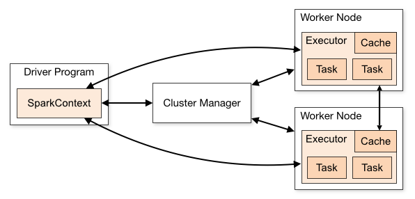
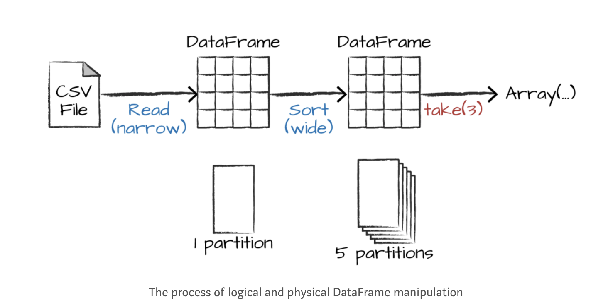
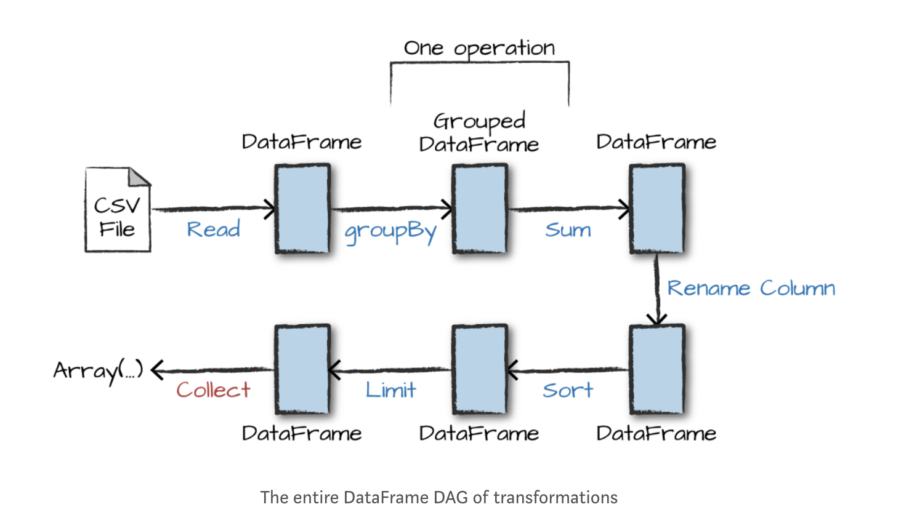

## Apache Spark的快速入门 (Python版)

原文地址：https://medium.com/explore-artificial-intelligence/introduction-to-core-spark-concepts-1e4ec879b9af  

参考来源：  
《A Gentle introduction to Apache Spark》 by Databricks   
《Learning Spark》by Holden Karau   
 [Spark基本概念快速入门](https://www.jianshu.com/p/e41b18a7e202)

近年来，Apache Spark的快速发展使得它一跃成为大数据爱好者的心头好。简单的概括，Spark是一个快速且强大的框架，给数据科学家，数据工程师们提供了处理大规模数据集的利器。  

本文梳理了Spark中Drivers和Executors工作的方式，并且展示了一个完整的端到端独立的小项目，目的是帮助大家快速入门Apache Spark。

### Spark和Jupyter Notebook工作环境配置
关于单机Pyspark和Jupyter Notebook的环境配置，可以参考这两篇文章:[《Get Started with PySpark and Jupyter Notebook in 3 Minutes》](https://blog.sicara.com/get-started-pyspark-jupyter-guide-tutorial-ae2fe84f594f)和本文作者的另一篇Blog[《Downloading spark and getting started with python notebooks (jupyter) locally on a single computer》](https://medium.com/explore-artificial-intelligence/downloading-spark-and-getting-started-with-python-notebooks-jupyter-locally-on-a-single-computer-98a76236f8c1)。
  
### 本文内容概览
1. 弹性分布式数据集 (RDD) 
2. 驱动器 （Drivers） 和 执行器 （Executors）
3. Spark Context 和 配置（Configuration）  
4. 举个栗子
5. 介绍有向无环图(Directed Acyclic Graph, DAG)

### RDD 和 Datasets
说到Spark，第一个要介绍的概念就是弹性分布式数据集RDD（Resilient Distributed Datasets）。在Spark 2.0之前，主要的interface就是RDD。在Spark 2.0之后，他们优化了RDD为Dataset，其实他们非常相似，和Pandas中的Dataframe也很类似。不同的是，Python和R的Dataframe只能在单机上存储。而在Spark中，为了将程序运行在分布式的集群上，数据会被拆分成多个Partition。  
在Spark中的操作，基本都可以视为对RDD这个对象的操作。初级阶段，我们只需要了解一些就可以了。
RDD创建后，针对RDD的操作只有两种：转化（Transformation）和行动（Action）。  
#### Transformation
在Spark中，核心的数据结构（即Dataset或RDD）是不可变的。要“改变”一个数据结构，你需要用到Transformmation。Transformation是返回一个新的Dataset，如map(),filter()等。Spark对于Transformation采用惰性计算机制(Lazy Evalution)，遇到Transformation时并不会立即计算结果，而是要等遇到Action时才一起执行。
   
```
# 前几行是SparkContext的部分，会在下文提到
from pyspark import SparkContext, SparkConf
conf = SparkConf().setAppName("My Dataframe")
sc = SparkContext(conf = conf)

# 导入SparkSession来操作dataset
from pyspark.sql import SparkSession 
spark = SparkSession(sc) # 将 Spark Context 传给 SQL module

myRange = spark.range(1000).toDF("number")

# myRange 就是一个 Spark DataFrame，一列，1000行，分别是0到999
# transformation
divisBy2 = myRange.where("number % 2 = 0") #将dataframe按奇偶分成两部分
# 此时没有输出，因为是惰性的
```
#### Action
Action对已有的数据执行计算产生结果，将结果返回Driver程序或写入到外部物理存储。
下面的例子对上述Transformation后的dataset进行操作。

```
# 显示 Dataset 的前两行
myRange.show(2)
# 显示 Dataset 中的总行数
divisBy2.count()
# 返回所有的记录
divisBy2.collect()
```

### Drivers 和 Executors
Spark在分布式环境中的架构如下图。  
  
图源：[Spark Cluster Overview](http://spark.apache.org/docs/latest/cluster-overview.html)    

每个Spark应用在执行过程中都会启动一个Driver，Driver的作用是将Job转为Task并交给多个并行的Executor上。典型的Driver程序可以是Spark Shell自己，或者你也可以自定义自己想要执行的代码。  

Driver进程是通过Spark Context这个API来执行main方法，提交job，并将job转变为task，同时协调各个Executor。   
每个Executor之间独立运行，各自负责完成自己的任务。同时，也为需要的RDD提供存储功能。   
在Shell中，SparkContext已经自动为你创建好，变量名为sc。然后就可以建立RDD了。
 
```
sc.textFile("README.md")
```
现在，这个RDD表示文件中文本的每一行。接着，我们就可以在这些行上进行操作，如：  
  
```
lines.count()  # 计算RDD中的行数  
```    
  
如果我们是在一个集群上运行```count()```这个命令，不同的Executor会分别计算文件不同部分的行数。  
  
我们可以把这个README的例子引申一下，让他过滤出文件中包含特定单词的行，例如：Python。  
  
```
# 单词过滤
lines = sc.textFile("README.md") # Create an RDD called lines
pythonLines = lines.filter(lambda line: "Python" in line)
pythonLines.first()
# 输出
#'high-level APIs in Scala, Java, Python, and R, and an optimized #engine that'
```   
有趣的是，这种函数式的操作，例如```filter```也可以在集群上并行进行，所以你可以只在Driver上写代码，然后自动在多个节点上运行。  

### 单独运行application
除了在交互命令行下运行，Spark也可以直接用Java, Scala, Python做单独的应用。和在Shell中的主要区别就在于我们需要自己初始化一个Spark Context。在这之后的操作就都一样了。
 
```
from pyspark import SparkConf, SparkContext
conf = SparkConf().setMaster("local").setAppName("My App")
sc = SparkContext(conf = conf)
```
  
初始化SparkContext的时候我们传递了两个参数：  
1. 一个是集群的URL，在这个例子中用local表示在本机上运行。  
2. 一个是application的名字：My App
  
当我们准备关闭Spark时，使用```stop()```方法。  
  
```
sc.stop()
``` 


最后，我们需要在命令行中执行这个程序。例如，当我们写了一个叫HelloWorld.py的代码，如果我想用Spark运行，我们需要spark-commit这个命令。  

一个完整的WordCount.py的代码如下。这段代码的目的是计算文本中单个单词出现的次数。

```
# 初始化 Spark Context
from pyspark import SparkContext, SparkConf
conf = SparkConf().setAppName("Word Counter")
sc = SparkContext(conf = conf)

# 读入文件，转化为RDD
myTextFile = sc.textFile("/Users/bsuvro/spark-2.3.0-bin-hadoop2.7/README.md")

# 去掉文件中的空行
non_emptyLines = myTextFile.filter(lambda line: len(line) > 0)

# 将整个文件split成单个的单词，然后展平成一个由单个单词组成的RDD
words = non_emptyLines.flatMap(lambda x: x.split(' '))

# 执行三个不同的函数 
# a) .map() - 将每一行的单词转化成tuple，e.g. ('apple', 1) etc.
# b) .reduceByKey() - 将每个tuple按照key归并,e.g. ('apple', 5) etc.
# c) .map() - 改变tuple内元素的顺序然后按照key的大小排序

wordCount = words.map(lambda x: (x, 1)).\
                    reduceByKey(lambda x, y : x + y).\
                        map(lambda x: (x[1], x[0])).sortByKey(False)

# 将这个 RDD 存成文本文件
wordCount.saveAsTextFile("wordCountResult")
# 注意，这里会存成不同partition

# 使用 coalesce() 转化为一个文件 
wordCount.coalesce(1).saveAsTextFile("wordCountResult2")
```
上面的代码可以直接使用IDE运行，例如Jupyter Notebook。如果将它保存成.py文件，那就需要用上面提到的spark-submit来运行。

```
cd spark-2.3.0-bin-hadoop2.7/
bin/spark-submit /Users/bsuvro/WordCounter.py
```

### 举个栗子

数据来源：
使用git clone获取数据，来源为databricks。

```
git clone https://github.com/databricks/Spark-The-Definitive-Guide
```
在repo中进入以下目录找到我们需要的csv文件。

```
cd Spark-The-Definitive-Guide/data/flight-data/csv
```
打开Jupyter Notebook，运行下面的代码。

```
from pyspark import SparkContext, SparkConf
conf = SparkConf().setAppName("EndToEndApp")
sc = SparkContext(conf = conf)

from pyspark.sql import SparkSession 
spark = SparkSession(sc)

# 读入csv成dataset
flightData2015 = spark\
        .read\
        .option("inferSchema", "true")\
        .option("header", "true")\
        .csv("data/flight-data/csv/2015-summary.csv")

# 查看 dataset 的前两行
flightData2015.take(2)

# 以count列的数字为基准排序，spark会为这个方法做一个plan，告诉我们会如何处理这个cluster。
flightData2015.sort("count").explain() # sort and looking at the explain plan

# sort是一种宽依赖，这样就像是将父RDD中的所有分区进行了洗牌（Shuffle）
# sort默认设置是200个shuffle partitions，我们将它设置为5
spark.conf.set("spark.sql.shuffle.partitions", "5") # setting number of partions

# 查看排好序后的前5个
flightData2015.sort("count").show(5)

flightData2015.createOrReplaceTempView("flight_data_2015") # creating a temporary view from DF

# 接下来我们使用SparkSQL
# Groups by dest_country_name and count how many using SQL
sqlWay = spark.sql("""
SELECT DEST_COUNTRY_NAME, count(1)
FROM flight_data_2015
GROUP BY DEST_COUNTRY_NAME
""")

# Same using DataFrame operations
dataFrameWay = flightData2015\
    .groupBy("DEST_COUNTRY_NAME")\
    .count()
    
# We will use the max function, to establish the maximum number of flights to and from any given location.

spark.sql("SELECT max(count) from flight_data_2015").take(1) # using SQL

from pyspark.sql.functions import max
flightData2015.select(max("count")).take(1) # using DataFrame operations

# top five destination countries in the data  

# SQL Way
maxSql = spark.sql("""
SELECT DEST_COUNTRY_NAME, sum(count) as destination_total
FROM flight_data_2015
GROUP BY DEST_COUNTRY_NAME
ORDER BY sum(count) DESC
LIMIT 5
""")

maxSql.show()

# DataFrame way
from pyspark.sql.functions import desc

flightData2015\
  .groupBy("DEST_COUNTRY_NAME")\
  .sum("count")\
  .withColumnRenamed("sum(count)", "destination_total")\
  .sort(desc("destination_total"))\
  .limit(5)\
  .show()
  
# Look for the explain plan to understand the flow of steps.
```

### DAG
通过上面的例子，我们对Spark如何运行就有了进一步的了解，下图是dataset操作的基本流程。
  
上图中，蓝色的是transformation，红色的是action，记住只有到action时，spark才真正的进行操作。    
  
那么我们总结一下Spark的执行计划（Execution Plan）:  

* 用户定义了有向无环图DAG,会产生新的不可改变的Dataset,这样就创建了一个图。
* 有了执行计划，等Action时就可以执行任务，其中每个步骤都对应着DAG中的一个或几个Dataset
* 在Cluster中按顺序处理，其中每个task都是一个Executor独立运行的。当最后一个步骤完成，一个Action也就完成了。

以我们上面的统计飞行次数的例子为例：
  

到这里，我们就能对Spark的运行过程有一个直观清晰的概念了。本文的代码可在这个repo中获得，希望大家喜欢~
